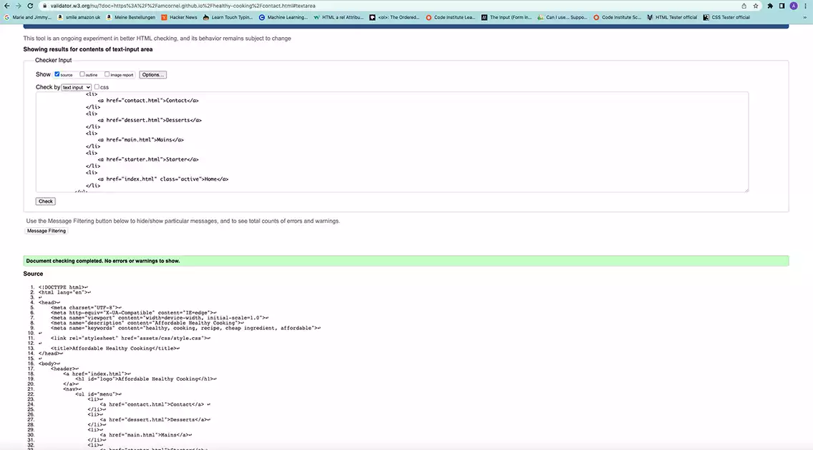
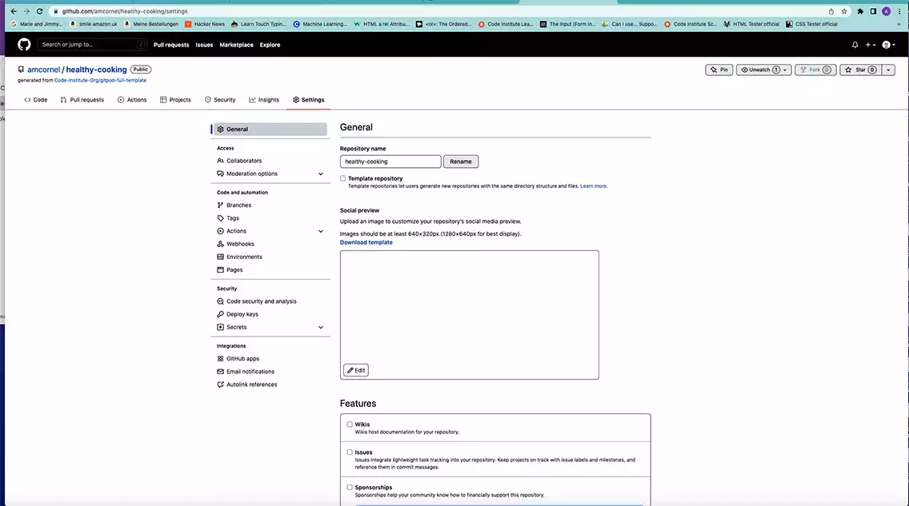
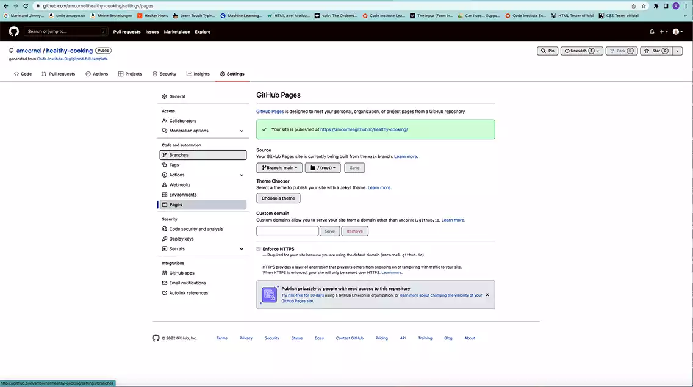

# AFFORDABLE HEALTHY COOKING

## Features

Affordable Healthy Cooking is a web page that will help viewers
 eat healthy without spending a fortune. 
 
 It advises on where to buy products and how to prepare them in a fast and effective
 Way. 
 
 It provides information on how to prepare a Starter, Main and Dessert.

 

### Existing Features

    Navigation Bar

            The Navigation Bar is on all 5 pages featured and is fully responsive including the Logo.

            This will allow the viewer to navigate easily forward and backwards. 
            It has an active hoover function with an excellent visible background colour. 
            At anytime, the Viewer knows precisely where he is and what he is about to do

### Homepage

    Homepage Image

            The Homepage Image displays tasty, healthy food. It shows the ingredients used in the recipes. 
            It is the central point on the page and has a zoom-in feature to make it more attractive to the viewer
attractivemage](assets/img/hero-image2.webp)

    Eat Healthy Section

            This Section explains what we want to achieve. 

    How To Prepare Section

            This explains what will be provided to the viewer

### Footer

The Footer contains Social Media Links. 

            
### Starterpage

The Starter page provides a picture of the Starter and an Ingredient List and how to prepare

The Picture is the central point.

The Instructions on how to prepare are placed underneath, and the ingredient list is on the left Site.

### Mainspage

The Mains page provides a picture of the Mains and an Ingredient List and how to prepare

The Picture is the central point.

The Instructions on how to prepare are placed underneath, and the ingredient list is on the left Site.

### Dessertpage

The Dessert page provides a picture of the Dessert and an Ingredient List and how to prepare

The Picture is the central point.

The Instructions on how to prepare are placed underneath, and the ingredient list is on the left Site.

### Contactpage

The Contact page contains a contact form to send the First and Second Names and the eMail Address with a send button.
The Company contact details are listed underneath that form

## Testing

### Validator Testing

#### HTML

            index.HTML Test passed no errors found

#### CSS

## Unfixed Bugs

## Deployment

The Website was deployed on the 21.04.2022 with Github to GitHub Pages

        open project on GitHub

        Click on Settings in the Top Nav Bar

        Click on Pages in the Side List

        choose as branch "main."

        click save

## Credits

        HTML und CSS Das umfassende Handbuch 
        written by Juergen Wolf and published as
        Das Standard Werk by Rheinwerk Computing
        ISBN978-3-8362-8117-1

        was used to clear up misunderstandings or when things not working as attempted

        The Love Running Project walk through as aguide to set up the Nav Bar

        Google Search for project research

        GitHub Docs for basic README.md commands

        README template Love Running for basic structure of README.md

        https://tinypng.com/ for compressing Pictures

## Media

        I produced all the Media.

        Pictures taken with iPhone 13 Pro Max in RAW Mode

        Edited with Photoshop 2022 

